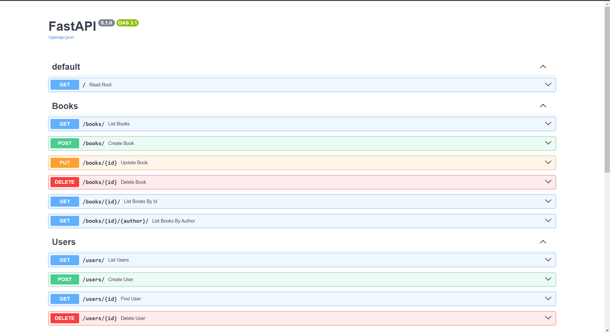

# MongoDB and FastAPI

## Overview

CRUD (Create, Read, Update, Delete) operations are essential functions for any software application. In this projetc tutorial, we will explore how to build a REST API using the FastAPI framework with Python and MongoDB, a non-relational database.

We will focus on creating a REST API for selling books using the FastAPI framework with Python. The data on books and the users purchasing them will be stored in the non-relational MongoDB database.

## Prequisites
* Python 3.x.x

* MongoDB Atlas sign-up - a highly performant and scalable database service provided by MongoDB. MongoDB is a leading NoSQL database used by companies like eBay, Adobe, and LinkedIn to manage large volumes of data efficiently.

* FastAPI [docs](https://fastapi.tiangolo.com/tutorial/) - as a web application framework to Display and monitor web scraping results from anywhere.

## Setup Environments

1. Setup python environments
```
python3 -m venv .venv
source .venv/bin/activate
```

2. Create `.env` file.
```
ATLAS_URI = ''
DB_NAME = 
```

### Directories Structure
```
├── /mongodb-fastapi-project-tutorial
│   │── .env
|   ├── __init__.py
│   ├── rules
│   │      ├── __init__.py
│   │      ├── books.py
│   │      ├── addresses.py
│   │      └── users.py
│   │
│   ├── endpoints
│   │      ├── __init__.py
│   │      ├── books.py
│   │      ├── addresses.py
│   │      └── users.py
│   │
│   ├── models
│   │      ├── __init__.py
│   │      ├── books.py
│   │      ├── addresses.py
│   │      └── users.py
│   │    
│   ├── routes
│   │    ├── __init__.py
│   │    └── api.py
│   ├── app.py
│   └── requirements.txt
```

## How-to Guide
1. Clone the repository
```
git clone https://github.com/VuBacktracking/mongodb-fastapi-project-tutorial.git
cd mongodb-fastapi-project-tutorial
```

2. Run the API with uvicorn
```
uvicorn app:app --reload
```

## Demo
<p align = "center">
    
</p>
